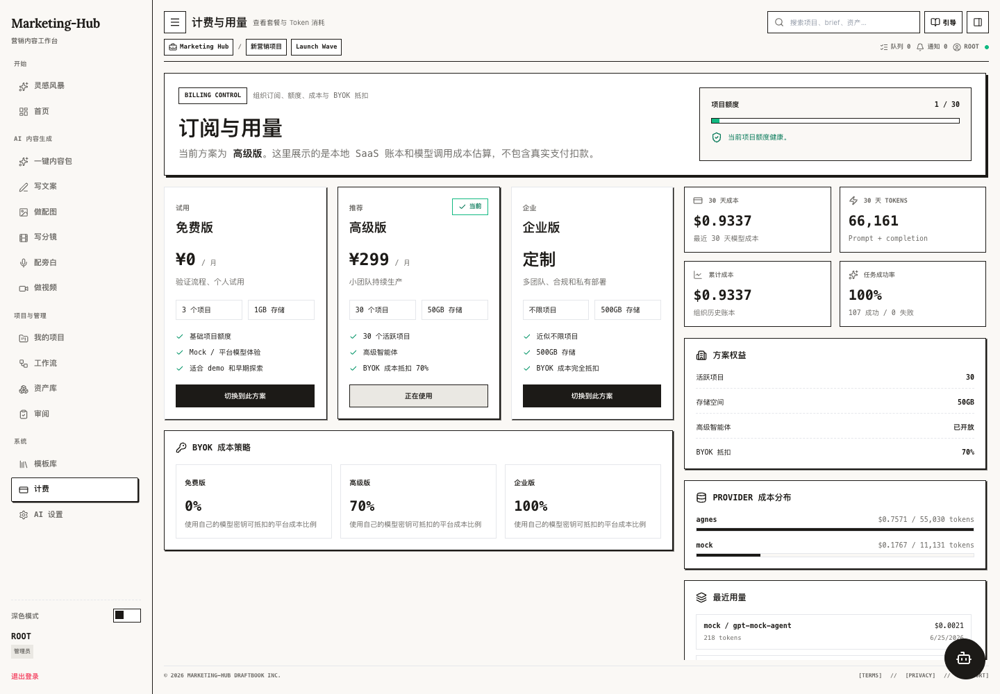

<a name="readme-top"></a>

<div align="center">
  

  <h1>Marketing Hub</h1>

  <p><strong>BLOW UP YOUR SIMPLE IDEA</strong></p>
  <p>一个面向营销内容生产、工作流编排、项目资产沉淀和 AI 成本治理的工作台。</p>

  <p>
    <a href="./docs/README.md">Docs</a>
    ·
    <a href="./docs/plans/workflow_ux_improvement_plan.md">Workflow Plan</a>
    ·
    <a href="./docs/architecture/ai_content_generation_prompt_governance.md">Prompt Governance</a>
  </p>
</div>

## Product

Marketing Hub 把一个简单想法扩展成可执行的营销生产链路：

- 从“灵感风暴”输入一句想法，生成品牌上下文和 workflow 草稿。
- 在可视化工作流中编排文案、图片提示词、配图、分镜、配音、视频和审核节点。
- 用“我的项目”管理项目、文件夹、活动、收藏、资产和品牌记忆。
- 在首页和计费页查看任务、成本、Token、Provider、成功率和工作区健康度。
- 通过 AI Gateway 统一模型配置、BYOK、fallback、成本审计和 Prompt 版本治理。

## Screenshots

| Brainstorm | Dashboard |
| --- | --- |
|  |  |

| Workflow | Projects |
| --- | --- |
|  |  |

| Billing |
| --- |
|  |

## Core Modules

| Module | What it does |
| --- | --- |
| 灵感风暴 | 将一句 idea 转为结构化品牌上下文和可运行 workflow 草稿。 |
| 首页 | 展示任务总量、成功率、Token、成本、趋势、Provider 成本和工作区健康度。 |
| AI 内容生成 | 覆盖内容包、文案、图片、分镜、配音和视频生成。 |
| 工作流 | React Flow 画布、节点 IO schema、自动布局、运行进度、失败重试和只读分享。 |
| 我的项目 | 项目列表、文件夹、收藏、详情 Inspector、当前项目切换和资产入口。 |
| 计费与用量 | 套餐、项目额度、BYOK 抵扣、Provider 成本和最近用量。 |
| AI 设置 | 多 provider 配置、模型选择、组织级密钥和能力 lane。 |

## Architecture

```text
marketing-hub/
  backend/        Django 3-domain SaaS backend, AI Gateway, workflow runtime
  frontend/       React 19 + Vite SPA, feature modules, React Flow canvas
  docs/           Product plans, architecture notes, prompt governance, pitch materials
```

Backend domain apps:

- `api`: shared models, serializers, contracts, RBAC, services, Celery tasks.
- `workspaces`: organizations, projects, folders, campaigns, drafts, templates, dashboard.
- `generation`: AI generation endpoints and workflow run/retry APIs.
- `ai_gateway`: provider adapters, model policy, cost calculator, prompt catalog.
- `billing`: plan limits, project quotas and usage summary.
- `community`: publishing, likes and inspiration search.
- `accounts`: session login and membership management.

Frontend entry:

- `frontend/src/App.tsx`
- `frontend/src/features/*`
- `frontend/src/components/WorkflowBuilder.tsx`
- `frontend/src/shared/*`

## Quick Start

### Docker

```bash
docker compose up
```

Services:

- Frontend: `http://localhost:5173`
- Backend API: `http://localhost:8000/api`
- PostgreSQL: `5432`
- Redis: `6379`

### Local Development

Backend:

```bash
cd backend
uv sync
uv run python manage.py migrate
uv run python manage.py runserver
```

Frontend:

```bash
cd frontend
npm ci
npm run dev
```

Worker:

```bash
cd backend
uv run celery -A core worker --loglevel=info
```

Demo account:

```text
username: ROOT
password: 123
```

## Environment

Backend:

```env
DJANGO_SECRET_KEY=
DJANGO_DEBUG=True
DJANGO_ALLOWED_HOSTS=
CSRF_TRUSTED_ORIGINS=
CORS_ALLOW_ALL_ORIGINS=
ALLOW_UNAUTHENTICATED_API=
SESSION_COOKIE_SECURE=
CSRF_COOKIE_SECURE=
SECURE_SSL_REDIRECT=
SECURE_HSTS_SECONDS=

DATABASE_URL=
POSTGRES_DB=
POSTGRES_USER=
POSTGRES_PASSWORD=
POSTGRES_HOST=
POSTGRES_PORT=

REDIS_URL=
CELERY_BROKER_URL=
CELERY_RESULT_BACKEND=
CELERY_TASK_ALWAYS_EAGER=
CELERY_TASK_EAGER_PROPAGATES=

MARKETING_HUB_BOOTSTRAP_DEMO=
AI_ALLOW_MOCK_PROVIDER=
AI_ALLOW_MOCK_FALLBACK=
```

Frontend:

```env
VITE_API_BASE_URL=http://localhost:8000/api
```

## Verification

Backend:

```bash
cd backend
uv run python manage.py check
uv run python manage.py test
```

Frontend:

```bash
cd frontend
npm run lint
npm run build
npm run test
```

## Documentation

- [Engineering Playbook](./ENGINEERING_PLAYBOOK.md)
- [Docs Index](./docs/README.md)
- [Development Workflow](./docs/operations/development_workflow.md)
- [Backend Modularization](./docs/architecture/backend_modularization.md)
- [Workflow UX Improvement Plan](./docs/plans/workflow_ux_improvement_plan.md)
- [Global AI Assistant Upgrade Plan](./docs/architecture/global_ai_assistant_upgrade_plan.md)
- [AI Content Generation Prompt Governance](./docs/architecture/ai_content_generation_prompt_governance.md)
- [Brand Memory Long-Term Evolution Plan](./docs/plans/brand_memory_long_term_evolution_plan.md)

## Repository Notes

- This repository intentionally keeps product docs and pitch materials under `docs/`.
- Generated/runtime artifacts stay out of Git through `.gitignore`: `node_modules/`, `dist/`, `.venv/`, `db.sqlite3`, `.env`, `.DS_Store`, caches and Python bytecode.
- The current product visual direction is editorial, minimal, monochrome-first, with yellow used as a small activation signal.

<p align="right"><a href="#readme-top">Back to top</a></p>
