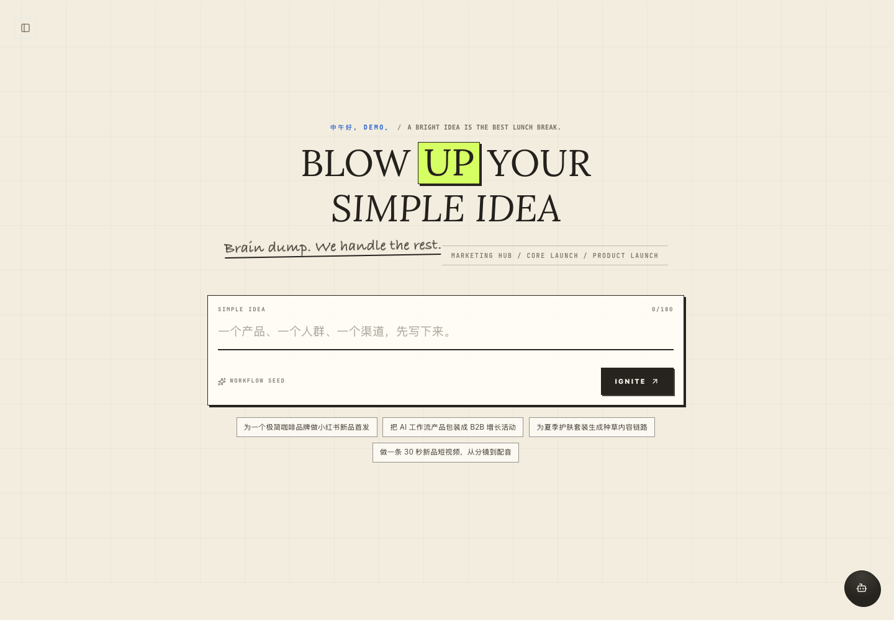
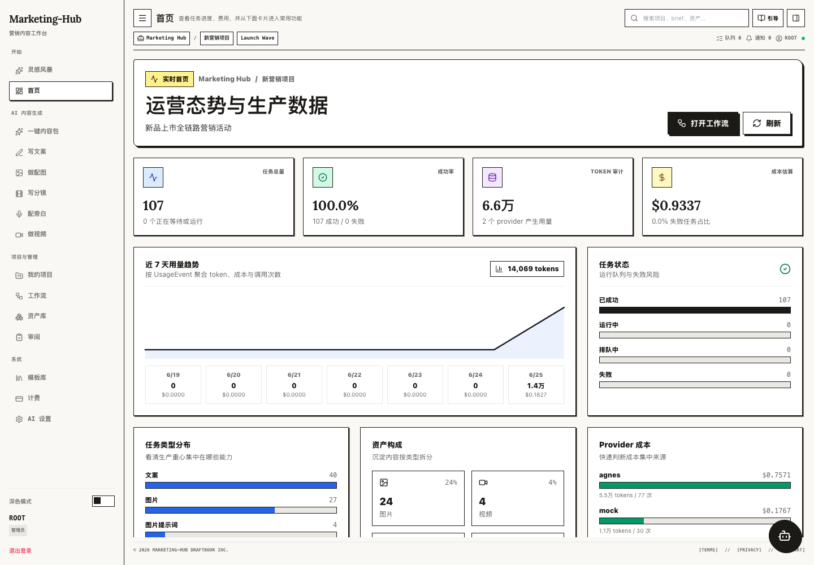
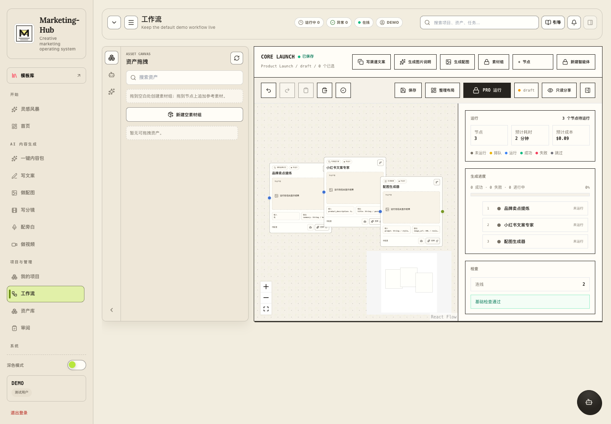
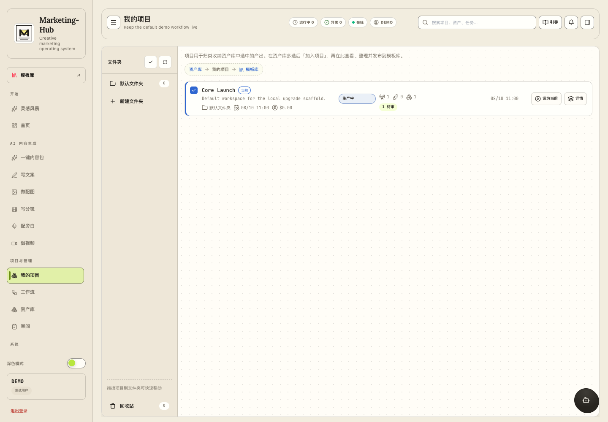

<a name="readme-top"></a>

<div align="center">
  

  <h1>Marketing Hub</h1>

  <p><strong>Turn one idea into an accountable AI marketing workflow.</strong></p>
  <p>A modular workspace for campaign planning, multimodal content generation, visual workflows, project assets, and AI cost governance.</p>

  <p>
    <a href="./README.zh-CN.md">简体中文</a>
    ·
    <a href="#quick-start">Quick start</a>
    ·
    <a href="./docs/README.md">Documentation</a>
    ·
    <a href="./CONTRIBUTING.md">Contributing</a>
  </p>

  <p>
    <a href="https://github.com/yruichen/marketing-hub/actions/workflows/ci.yml">
      
    </a>
    
    
    
    
    
    <a href="https://github.com/yruichen/marketing-hub/stargazers"></a>
  </p>
</div>

## What It Does

Marketing Hub expands a simple brief into a traceable production system:

- Turn an idea into structured brand context and a runnable workflow draft.
- Orchestrate copy, image prompts, images, storyboards, audio, video, and review nodes on a visual canvas.
- Organize projects, folders, campaigns, favorites, reusable assets, templates, and brand memory.
- Track generation tasks, provider usage, tokens, cost, success rate, and workspace health.
- Govern multiple AI providers through lane-based model selection, BYOK, explicit failure policy, prompt versions, and cost auditing.

## Product Tour

| Idea to campaign | Workspace health |
| --- | --- |
|  |  |

| Visual workflows | Project assets |
| --- | --- |
|  |  |

## Why Marketing Hub

Most AI content tools stop at a generated result. Marketing Hub treats generation as an operational workflow:

- **Traceable execution** — queued, running, succeeded, and failed tasks are persisted and observable.
- **Composable workflows** — a DAG runtime validates node inputs and outputs, runs nodes in topological order, and supports retry.
- **Provider independence** — business features call one AI Gateway instead of coupling directly to a model vendor.
- **Tenant-aware collaboration** — organizations, memberships, RBAC, projects, campaigns, and assets share one workspace model.
- **Cost-aware generation** — provider, model, token, fallback, and estimated cost data remain attached to the work.

## Architecture

```text
React 19 + Vite + React Flow
              │
              │ session auth + REST API
              ▼
Django + DRF ── AI Harness ── model providers
      │              │
      │              └── contracts, policy, prompts, tools, cost
      ├── PostgreSQL
      └── Celery + Redis
```

The desktop client reuses the same React product code through a separate,
sandboxed Electron delivery layer. Django remains the only server and data
source of truth.

The monorepo is split by runtime:

```text
marketing-hub/
  backend/        Django domain apps and provider-neutral AI harness
  frontend/       React SPA, feature modules, visual workflow builder
  desktop/        Electron lifecycle, preload bridge, packaging, release boundary
  docs/           Public product, architecture, and contributor docs
```

Backend domains include `accounts`, `workspaces`, `generation`, `community`, and `billing`. The `harness` package owns AI capability contracts, prompt versions, policies, runtime, provider/tool ports, and adapters. Shared models, RBAC, serializers, and compatibility services live in `api`.

## Quick Start

### Docker Compose

Prerequisites: Docker and Docker Compose.

```bash
git clone https://github.com/yruichen/marketing-hub.git
cd marketing-hub
docker compose up
```

Then open:

- Frontend: `http://localhost:5173`
- Backend API: `http://localhost:8000/api`

The Docker development configuration also starts PostgreSQL, Redis, and a Celery worker.

> Create an account and workspace explicitly, then configure an active AI provider in AI Settings. Missing provider configuration is surfaced as a setup-required state; the application never fabricates generation results.

### Local Development

Backend — Python 3.12 with `uv`:

```bash
cd backend
uv sync
uv run python manage.py migrate
uv run python manage.py runserver
```

Frontend — Node.js 22:

```bash
cd frontend
npm ci
npm run dev
```

Worker:

```bash
cd backend
uv run celery -A core worker --loglevel=info
```

Desktop — after installing frontend dependencies and starting the API:

```bash
cd desktop
npm ci
npm run dev
```

See [frontend/.env.example](./frontend/.env.example) and [backend/.env.example](./backend/.env.example) for configuration.

## Verification

```bash
cd backend
uv run python manage.py check
uv run python manage.py test
```

```bash
cd frontend
npm run lint
npm run test
npm run build
```

GitHub Actions additionally checks migration drift and builds both production Docker images.

## Documentation

- [Documentation index](./docs/README.md)
- [Development workflow](./docs/operations/development_workflow.md)
- [AI harness architecture](./docs/architecture/ai_harness.md)
- [Backend modularization](./docs/architecture/backend_modularization.md)
- [Desktop architecture](./docs/architecture/desktop.md)
- [Desktop release operations](./docs/operations/desktop-release.md)
- [Public repository security](./docs/operations/public_repository_security.md)

## Project Status

Marketing Hub is under active development. The current focus is production hardening, workflow reliability, AI evaluation and governance, and a cleaner contribution surface.

Contributions and focused feedback are welcome. Read [CONTRIBUTING.md](./CONTRIBUTING.md), use the issue forms, and report vulnerabilities through [SECURITY.md](./SECURITY.md).

## Join the Community

- Pick a newcomer-friendly task from [`good first issue`](https://github.com/yruichen/marketing-hub/issues?q=is%3Aissue%20state%3Aopen%20label%3A%22good%20first%20issue%22) or [`help wanted`](https://github.com/yruichen/marketing-hub/issues?q=is%3Aissue%20state%3Aopen%20label%3A%22help%20wanted%22).
- Ask setup and usage questions in [GitHub Discussions](https://github.com/yruichen/marketing-hub/discussions).
- Propose product or architecture changes with the [feature request form](https://github.com/yruichen/marketing-hub/issues/new?template=feature_request.yml).
- If Marketing Hub is useful to you, a star helps more developers discover the project.

## Licensing

Marketing Hub is source-available under the [PolyForm Noncommercial License 1.0.0](./LICENSE). It may be used, modified, and redistributed only for permitted noncommercial purposes. Commercial use—including using the software to operate, support, or build a revenue-generating business—requires a separate written license from the copyright holder.

This is not an OSI-approved open-source license because it restricts commercial use. Focused issues and pull requests are welcome. By contributing, you agree that your contribution is licensed under the repository license and that you have the right to submit it.

<p align="right"><a href="#readme-top">Back to top</a></p>
